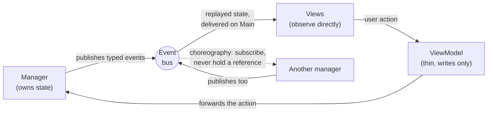
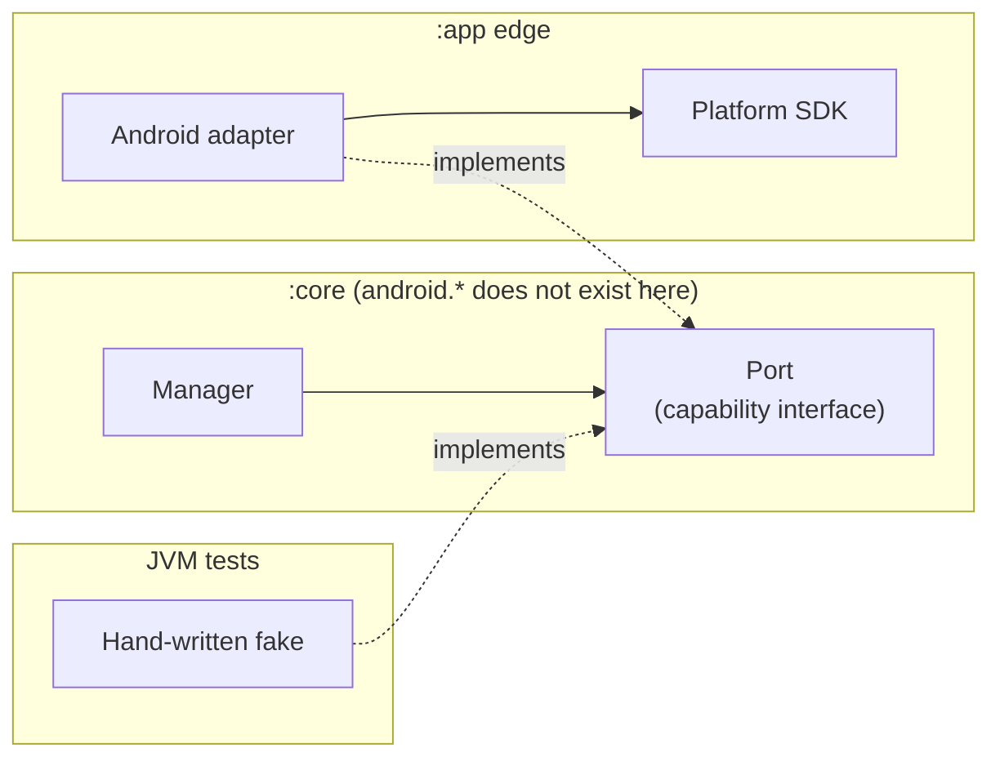
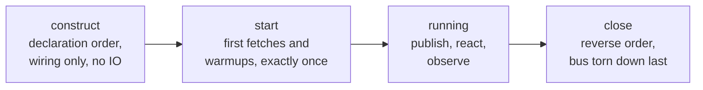
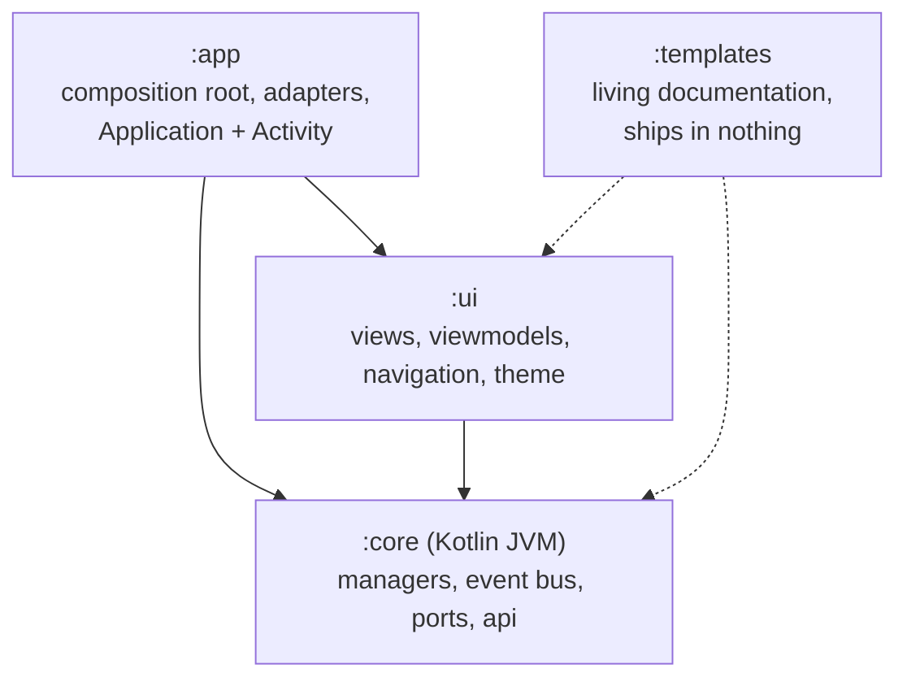

# Android-App-Template

A standalone Android app template: Jetpack Compose UI on top of an
event-driven manager core, split across three compiler-enforced
layer modules. The whole tree is readable in an afternoon. Deferred
designs live in [ARCHITECTURE-SCALING.md](ARCHITECTURE-SCALING.md),
each with an explicit adoption threshold.

## The architecture in short

Peer domain managers own all app state. Each manager publishes typed
events on a central bus when its state changes; views observe the bus
directly, viewmodels only forward user actions back to managers. A
single hand-wired composition root (`AppComponent`) constructs
everything in declaration order, tears it down in reverse, and runs
first fetches in a separate `start()` phase. Anything that touches
the platform (connectivity, Logcat, crash backends, remote flags)
sits behind a small port interface with the Android adapter at the
edge, which is what lets the entire core be a plain Kotlin JVM
module.

How state moves (one loop, one direction):



Where the platform touches the code (ports and adapters):



A component's life (each phase does one job):



### What this buys

- No god objects. Managers are peers with no references to each
  other; cross-feature behavior is a subscription, so features grow
  side by side instead of accreting into a coordinator.
- One observation idiom. State reaches the UI exactly one way
  (typed keys on the bus), so there is one threading contract, one
  replay rule, and one place every state transition can be traced.
- The compiler polices the layers. `:core` cannot import `android.*`
  because it is not on the classpath; `:ui` cannot reach adapters or
  the composition root because it does not depend on `:app`.
- Real tests without mocks. JVM specs boot a REAL component with
  fakes only at the port boundaries; there is no mocking framework
  in the repo.
- Deterministic lifecycle. Construction order is declaration order,
  teardown mirrors it structurally, and the init budget (no IO in
  constructors) keeps cold start out of wiring.

### What it costs

- Indirection. "Who reacts to this event" is a grep, not a call
  hierarchy; that stays manageable at this size and needs governance
  (catalogs, guards) as keys multiply.
- The bus is deliberately lossy. Latest-wins replay and DROP_OLDEST
  overflow are right for state projections and wrong for work items;
  anything that must not be lost needs the durable pipeline instead,
  and forgetting that rule causes subtle bugs.
- Event delivery rides the main thread. Invisible at human-scale
  traffic; a real cost at sustained high-rate publishing, with a
  documented threshold and fix in the scaling guide.
- Manual DI is hand-maintained. There are no compile-time
  missing-binding errors like Dagger's; guard tests and conventions
  stand in for them.
- Determinism across managers is a discipline, not a guarantee. Each
  manager is internally race-free (serial confinement), but two
  managers have no mutual ordering; tests and choreography must
  await facts, not assume them.
- The router is hand-rolled. Typed and process-death-safe, but
  predictive back, transitions, and per-screen scoping are deferred
  to the Navigation 3 threshold.

This is not Google's default architecture (ViewModel-centric state
holders per screen). It trades that familiarity for centralized,
observable app state; an app that is mostly independent CRUD screens
with little cross-feature state would not earn that trade, and the
standard stack would serve it more simply.

## Module structure

THE COMPILER IS THE ARBITER of the layering; cross-layer imports are
build failures, not review comments. Arrows point at what a module
may see:



- `:core` (Kotlin JVM library): the managers, the event bus, the port
  interfaces, and the API layer. `android.*` / `androidx.*` are not
  on the classpath, so platform code physically cannot creep in;
  everything platform-shaped arrives through ports. Ships the testkit
  (fakes, recorder) to the other modules as Gradle testFixtures.
- `:ui` (Android library): views, viewmodels, navigation, theme.
  Depends ONLY on `:core`, so UI composes manager interfaces and can
  never reach the `:app` edge (adapters, Hilt wiring, the composition
  root).
- `:app` (Android application): the composition root (`AppComponent`
  in `di/`), the platform adapters (`platform/`:
  `AndroidConnectivityMonitor`, `AndroidLogWriter`), `Application`,
  the single `Activity`, manifest, and resources. Depends on both.
- `:templates` (living documentation): fully-commented exemplar files
  (manager, port+adapter, page, viewmodel, destination, fake, specs)
  that compile and test on every build so they cannot rot, but which
  nothing depends on, so they ship in nothing. Start any new
  component by copying one; see [templates/README.md](templates/README.md).

Which module does a file go in: if it needs `android.*`, it is an
adapter (`:app/platform`) or UI (`:ui`); if removing every platform
detail leaves the logic intact, it is `:core`. The staged expansion
to more modules (`:data`, `:platform`, feature modules) is documented
in ARCHITECTURE-SCALING.md.

## Architecture

The component diagram in text:

```
BaseApplication ................. the Android edge (onCreate)
  builds filesDir, AndroidConnectivityMonitor, min log level
     |
     v  AppConfig (the composition root's single input value)
AppComponent (di/) .............. plain class, manual constructor
     |                            injection, close() in reverse order
     |-- eventManager ........... EventManager: the bus; OWNS every
     |        ^                   event stream (keys are identifiers)
     |        |  attachLogManager (the one sanctioned setter cycle)
     |-- logManager ............. platform log mirror + rotating
     |                            log file + telemetry funnel
     |-- connectivityManager .... validated connectivity, behind the
     |                            ConnectivityMonitor boundary
     |-- dataStoreManager ....... Preferences DataStore facade
     |-- featureFlagManager ..... layered flags: debug override >
     |                            provider (seam) > compiled default
     |-- httpClient ............. the ONE shared Ktor engine
     |                            (httpClientFactory seam); managers
     |                            wrap it in per-endpoint ApiClients
     |-- jokeManager ............ demo feature + the cross-manager
     |                            choreography exemplar
     v
AppModule (Hilt) ................ thin adapter exposing the component's
     |                            members to @Inject sites
     v
MainActivity .................... provides LocalEventManager; deep
     |                            links arrive as plain strings
     |-- navigation/ ............ AppRouter: typed destinations,
     |                            per-tab back stacks, ONE deep-link
     |                            mapper; JSON-saved across process
     |                            death
     |-- views/ ................. observe events directly via
     |                            eventState / eventStateOrNull
     |-- viewModels/ ............ thin: user actions and writes only
```

Managers are PEERS: there is no central coordinator, and no manager
holds a reference to another manager's internals. They publish typed
events on the bus and (rarely, deliberately) react to each other's
events. Data flows one way: managers publish, the UI listens,
viewmodels forward user actions back to managers.

### Composition root (`di/`)

- `AppConfig` gathers everything the component needs from the outside
  world into one value: the files directory (a typed `java.io.File`),
  the `ConnectivityMonitor` boundary, the minimum log level, an
  `httpClientFactory: (Json) -> HttpClient` seam (tests swap in a Ktor
  MockEngine), an injectable `Clock`, a `CrashReporter` seam (no-op by
  default), the `PlatformLogWriter` mirror, the `FeatureFlagProvider`
  seam with its overrides toggle, and the log-rotation cap. Every
  field with a production
  default can be overridden per test. Endpoint URLs are deliberately
  NOT here: each manager declares its own base URL beside itself and
  wraps the shared `httpClient` in its own `ApiClient`, so apps built
  on the template add services by adding clients, never by widening a
  global URL.
- `AppComponent` is a plain class: property initializers run top to
  bottom, so declaration order IS the construction order. Every
  member registers its own teardown BESIDE its declaration
  (`closedBy` for resources, `registered()` for managers), so
  `close()` just walks the self-mirrored registry in reverse
  construction order, cancelling the event bus LAST so teardown
  events still deliver; feature PRs never edit `close()` (the one
  hand-maintained step is the crash-handler restore, which must run
  FIRST and conditionally). The
  component also installs a `Thread` default uncaught-exception
  handler that reports the fatal to the `CrashReporter`, logs it
  (`logFatal`, so the crash is never double-counted), drains the log
  queue to disk (`flushForCrash`), and delegates to the previous
  handler. `start()` runs every manager's post-construction side
  effects in construction order; BaseApplication calls it right
  after construction.
- `BaseApplication.onCreate` is the only Android edge: it builds every
  platform-touching value (typed `File`, `AndroidConnectivityMonitor`,
  debug-vs-release log level from `BuildConfig.DEBUG`) and constructs
  exactly ONE `AppComponent` per process. Managers never see a
  `Context`, which is what lets JVM tests build a real component from
  fakes alone.
- `AppModule` is a thin Hilt adapter: every MANAGER provider reads a
  member FROM the component (plain build metadata like `BuildInfo` is
  constructed in place); Hilt never constructs a manager itself.

Wiring conventions (also stated in the `AppComponent` KDoc, which is
the source of truth):

1. Construction order is bus, logging, then peer managers.
2. Managers receive only what they use, by constructor, within a
   budget of five parameters (a bus handle counts as one). A manager
   that needs more is doing too much: split it (or group a policy
   value the way `LogFileSettings` does).
3. Never inject the component itself into a manager.
4. The one sanctioned setter cycle is
   `eventManager.attachLogManager(logManager)`, called in the
   component's init block. Add no others.
5. Feature managers APPEND at the end of their marked region and may
   depend on the infrastructure tier (bus, logging, flags,
   httpClient) but never on each other: cross-feature conversation
   rides published events, so concurrent feature PRs merge as
   trivially adjacent additions.
6. THE INIT BUDGET: construction may allocate, subscribe, and
   register cheap callbacks; it must NOT issue network requests or
   any unbounded-latency work. First fetches belong in the manager's
   `start()`, and a guard test fails any constructor that fetches
   (zero MockEngine requests before `component.start()`).

### The event contract

Event keys are plain named objects declared BESIDE the manager that
publishes them, in two flavors (`managers/eventManager/EventKey.kt`):

- `StateKey<Payload>`: a replayed state event. The payload type is
  part of the key's TYPE, so a mistyped `trigger` or `listenTo` does
  not compile. The latest payload is cached and replayed to late
  subscribers (latest wins under bursts).
- `SignalKey`: a payloadless one-shot notification; never replayed.

Event names follow `"namespace.EventName"`: the lowercase publishing
manager's namespace, a dot, then a PascalCase description. The keys
declared today:

- `JokeStateChanged`: `StateKey<JokeState>`, `"joke.StateChanged"`,
  SESSION lifetime, declared beside `JokeManager`.
- `NetworkConnectivityChanged`: `StateKey<Boolean>`,
  `"network.ConnectivityChanged"`, APP lifetime (connectivity is a
  device fact, not user state), beside `ConnectivityManager`.
- `HasSeenWelcomeChanged`: `StateKey<Boolean>`,
  `"datastore.HasSeenWelcomeChanged"`, SESSION lifetime, beside
  `DataStoreManager`.
- `LogsCleared`: `SignalKey`, `"log.Cleared"`, beside `LogManager`.
- `FeatureFlagsChanged`: `StateKey<FlagSnapshot>`, `"flags.Changed"`,
  APP lifetime, beside `FeatureFlagManager`.

Keys are PURE IDENTIFIERS; the streams live inside `EventManager`,
keyed by the key object. Rebuilding the manager (tests, component
rebuild) therefore drops every cached value instead of leaking state
through process-global objects. Each `StateKey` carries an
`EventLifetime` (`SESSION` by default, `APP` for device/process
facts): `eventManager.resetSessionReplayCaches()` clears the replay
caches of SESSION keys on logout or account switch, leaving APP keys
and all subscriptions untouched.

The contract every publisher and subscriber can rely on:

- Publish-time validation: a payload whose runtime type contradicts
  the key is rejected and logged, never delivered (a backstop for the
  type-erased paths; typed paths do not compile when wrong).
- Unchanged state is not re-delivered: triggering a state key with a
  payload equal to the cached value is suppressed (subscribers
  already hold the current value; signals always deliver). Publishers
  therefore need no hand-rolled dedupe, and re-publishing state to
  "nudge" listeners does not work by design.
- Owner lifecycle: `listenTo(key, owner) { ... }` runs the callback
  WITH THE OWNER AS RECEIVER while the bus holds the owner weakly.
  Reach the owner only through the receiver (pass lambda literals;
  when the owner is not `this`, enclosing members need an explicit
  `this@Outer`) and the subscription dies with it. A callback that
  CAPTURES the owner pins it, so deterministic teardown is the
  PRIMARY contract: ViewModels call `unsubscribeOwner` in onCleared,
  sessions in their teardown, and managers simply rely on the bus
  dying with the component; auto-removal is the safety net.
- Ordering (the five rules, from the `EventManager` KDoc): delivery
  order ACROSS keys is unspecified; per-key delivery is in trigger
  order; UI listeners always run on the main dispatcher; a listener
  never observes a replay older than the latest trigger; triggers are
  synchronous, callable from any thread, and never block (overflow
  drops the OLDEST buffered event, latest wins).
- A listener that throws is logged loudly and KEPT ALIVE; one bad
  payload must not silently kill a screen's subscription.
- Every trigger passes one breadcrumb choke point: it always reaches
  the crash report's breadcrumb ring, and lands in the log file as a
  DEBUG line only when the minimum level admits it (debug builds), so
  the whole app's event traffic is greppable there.

Latest-wins replay means events are projections of state, never a
lossless work queue. Work that must not be lost belongs in a durable
pipeline; see the doctrine in
[ARCHITECTURE-SCALING.md](ARCHITECTURE-SCALING.md).

### Managers and concurrency

Every manager extends `ConfinedManager`, which provides the same
concurrency rails (`managers/ConfinedManager.kt`):

- A NAMED SERIAL CONFINEMENT: one thread's worth of
  `Dispatchers.Default`, named after the manager. Because the scope
  runs at most one coroutine at a time, plain `var` state is safe and
  check-then-set sequences are atomic, with no locks and no
  main-thread dependency.
- A supervised scope with a `CoroutineExceptionHandler`: an uncaught
  coroutine exception crashes an Android app, so the handler is
  load-bearing. It logs through the injected `LogManager`.
- `onIo` / `onCpu` offload helpers, with one rule: READ confined state
  before offloading (capture into locals), WRITE it after returning.
- `start()`, called once by `AppComponent.start()` in construction
  order: the home for first fetches and warmups the init budget
  keeps out of constructors (JokeManager's first load lives here).
- `close()`, called by the component in reverse construction order.

Transient failures retry through `util/Retry.kt`: `RetryPolicy` plus
`retry` (one-shot operations: bounded attempts, capped exponential
backoff, cancellation and permanent failures rethrow immediately) and
`retryForever` (long-lived stream bridges: the block's `onHealthy`
hook resets the backoff on each successful emission). Both DataStore
bus bridges ride `retryForever`, so one bad read costs a delay, not
the feature. Work that must survive process death is NOT retry
material; it belongs to the durable job pipeline
(ARCHITECTURE-SCALING.md).

UI delivery is unaffected: `listenTo` callbacks always arrive on the
main dispatcher, whatever thread the manager published from.

### Cross-manager choreography (the canonical pattern)

`JokeManager` demonstrates how managers react to each other while
staying peers: it subscribes to `NetworkConnectivityChanged` in its
init block with the manager ITSELF as owner (the subscription then
lives exactly as long as the manager), and hops each callback onto its
own confinement before touching mutable state, because callbacks are
delivered on Main. Behavior: when `JokeAutoRetryOnReconnectFlag` is
enabled (off by default) and the last fetch FAILED and connectivity
transitions from offline to online, it auto-refreshes exactly once
per failure. Copy this shape (subscribe in init,
`owner = this`, react on your own confinement) for any manager that
needs to react to another manager's events.

### Boundaries and crash safety

- `ConnectivityMonitor` (in `:core`) isolates the platform's
  connectivity machinery; `AndroidConnectivityMonitor` (in
  `:app/platform`) is the real adapter, tests inject a fake and drive
  changes by hand. `PlatformLogWriter` is the same shape for the
  Logcat mirror (`AndroidLogWriter`); JVM tests keep its no-op
  default. Ports live in `:core`, where the missing Android classpath
  makes the isolation structural.
- `Clock` (from `kotlin.time`) is injected via `AppConfig` wherever
  wall time is read (log timestamps), so tests can pin time.
- `BuildInfo` (versionName, build stamp, isDebugBuild) is constructed
  from BuildConfig in `:app` and injected into the UI layer, which
  has no application BuildConfig of its own.
- `CrashReporter` (`managers/logManager/CrashReporter.kt`, in
  `:core` beside its owning manager) is the crash-backend seam
  (its KDoc carries copy-paste Crashlytics and Sentry shapes). The
  component's handler calls `recordFatal`; everything else funnels
  through the LogManager: every accepted ERROR line becomes a
  `recordNonFatal` (the attached throwable, or a call-site-stamped
  `LoggedError`), and every bus trigger plus every WARN/ERROR line
  becomes a `recordBreadcrumb`, so release crash reports carry the
  recent app history even though DEBUG traces stay out of the file.
- `LogManager` writes through a bounded single-writer channel so
  logging never does IO on the calling thread, with two crash-forensic
  exceptions: ERROR-level lines drain the queue synchronously before
  the call returns (BOUNDED at 64 commands, so a full queue can never
  ANR the calling thread; the writer lands any remainder moments
  later), and `flushForCrash()` keeps the unbounded drain for a dying
  process. Failed file writes report through Logcat, one non-fatal
  per process, and an honest marker line in the log itself. The log
  file rotates by size (`base-app.log` becomes `base-app.1.log` at
  the `AppConfig` cap; one rotated file is kept), and
  `writeExportSnapshot()` copies rotated-plus-live into an export
  file that Settings shares as a FileProvider URI stream (never
  `EXTRA_TEXT`, which drops history and risks the ~1 MB Binder cap).

### Feature flags

Typed boolean flags with three value layers, most specific wins:
debug override > provider > compiled default.

- A flag is an `object` extending `BooleanFlag`, declared BESIDE the
  feature that consumes it (like an event key) and listed in
  `AppFlags.all`; `FeatureFlagRegistryGuardTest` fails the build if a
  declaration is missing from the registry.
- `FeatureFlagManager` resolves all layers and publishes every change
  as `FeatureFlagsChanged` (a full `FlagSnapshot`). Managers read
  `isEnabled(flag)` synchronously AT DECISION TIME (never cache it at
  construction); views observe with the one-line `flagState(flag)`
  composable.
- `FeatureFlagProvider` (`managers/featureFlagManager/`) is the
  remote-backend seam, a no-op by default; tests drive a fake by hand
  (see the deferred vendor-adapter design in ARCHITECTURE-SCALING.md).
- Overrides are DEBUG ONLY: the "Feature flags" row under Settings >
  Debug opens a modal sheet listing every declared flag with its live
  resolved state, the layer that decided it, and a Default/On/Off
  override control. Overrides persist in a dedicated DataStore file
  and survive relaunches. Release builds never create that store
  (`AppConfig.featureFlagOverridesEnabled` is false), so they are
  structurally locked to defaults plus provider values.
- `JokeManager` is the live example: `JokeAutoRetryOnReconnectFlag`
  (off by default) gates the reconnect auto-refresh choreography;
  enable it from the sheet to watch the choreography run.

### Navigation

A hand-rolled typed router (`navigation/`), mirroring the iOS
sibling's HomeRouter and deliberately shaped like Navigation 3 so the
library migration at threshold is mechanical (the recipe lives in
ARCHITECTURE-SCALING.md):

- Destinations are DATA: `AppTab` (the root tabs) and per-tab sealed
  hierarchies (`HomeDestination.JokeDetail(jokeId)`). Every switch is
  exhaustive; adding a screen is a compile error until handled, and
  no index can fall into a silent else.
- `AppRouter` holds the selected tab plus one `TabRouter` back stack
  per tab; `TabStackHost` renders each stack inside the keep-alive
  shell, so the tab bar stays visible on pushed screens and stacks
  survive tab switches. System back pops the selected tab's stack
  and otherwise finishes the activity; re-selecting a tab pops it to
  its root.
- Process death: the WHOLE navigation state round-trips through one
  JSON string in saved instance state (`rememberAppRouter`); corrupt
  or stale state from an app update restores to a fresh root, never
  a crash. Destination arguments follow the payload-evolution rules.
- Deep links (`baseapp://joke/<id>`, same scheme as iOS) map to
  destinations in ONE JVM-testable method,
  `AppRouter.handleDeepLink`; MainActivity only moves strings
  (singleTop plus onNewIntent).
- THE SEAM RULE: managers and viewmodels never navigate; they publish
  facts, and the shell (the router's only owner) maps facts to router
  calls in one choke point (`RouteOnAppEvents`). Direct user actions
  stay semantic lambdas (`onOpenJokeDetail`), wired to the router at
  the shell, so pages remain previewable and navigation-free.

### UI layer

- `views/` + `views/components/`: pages and reusable components; every
  composable has a `@Preview`, backed by stateless content
  composables.
- `viewModels/`: thin Hilt viewmodels (writes and user actions only;
  views observe events directly via `eventState`/`eventStateOrNull`
  from `EventManagerCompose.kt`, backed by the `LocalEventManager`
  CompositionLocal that `MainActivity` provides).
- `animations/AppAnimations.kt`: ALL motion definitions live here.
- `constants/`: `BrandColors` semantic tokens (`LogLevel` lives in
  `:core`'s constants package).

## Demo feature pattern

`JokeManager` shows how to add a feature: declare the service's base
URL beside the manager and wrap the shared `httpClient` in the
manager's own `ApiClient`, subscribe in init but fetch in `start()`
(the init budget), publish ONE state event (`JokeStateChanged`, a
`StateKey<JokeState>` declared beside the manager) whose payload
carries the whole story (REFRESHING, then SUCCESS or FAILED,
retaining the last good joke), let views listen, and let the
viewmodel forward user actions. The pushed `JokeDetailPage` shows the
navigation half: a typed destination with an argument, reached only
through the router, rendered from bus state. Copy those shapes for
real features; each new service gets its own per-endpoint `ApiClient`
on the same shared engine.

## Stack

Kotlin 2.4.10, AGP 9.0.1 (built-in Kotlin; do NOT apply
`org.jetbrains.kotlin.android`), Gradle 9.1.0, compileSdk 36, minSdk 32,
Hilt 2.60.1 + KSP, Compose BOM 2026.06.01, Ktor 3.5.1 (OkHttp engine),
DataStore 1.2.1 (the `-core` KMP artifacts, which is what lets the
managers live in `:core`), kotlinx-serialization, kotlinx-datetime,
okio.

## Build

```
./gradlew :app:assembleDebug
```

No external checkouts required; this repo is self-contained.

## Tests

JVM unit tests exercise a REAL `AppComponent` per test with boundary
fakes only. They span the modules: `:core` holds the bus-contract,
recorder, and retry specs (plain JVM, no AGP), `:ui` holds the router
spec, and `:app` holds the component-level specs and the guards:

```
./gradlew :core:test :ui:testDebugUnitTest :app:testDebugUnitTest
```

- The fakes, the recorder, and `awaitTrue` live in `:core`'s
  testFixtures, consumed everywhere via
  `testFixtures(project(":core"))`; `TestAppContext` itself lives in
  `:app`'s tests because it builds the real `AppComponent`.
- `testkit/TestAppContext` builds the component from `AppConfig` with
  a Ktor MockEngine (`FakeJokeApi`), a `FakeConnectivityMonitor`, a
  unique temp directory per test for the real DataStore and log file,
  a pinned `VirtualClock`, and a test Main dispatcher; `close()` in
  teardown restores everything.
- `testkit/TestEventRecorder` is the event assertion kit: suspending
  `expectEvent`/`expectState`, `assertOrder`, `assertNoEvent`.
- Suites: `EventManagerContractSpec` (validation, replay vs signal,
  session reset, `unsubscribeOwner`, both sides of the weak-owner
  contract), `JokeManagerLifecycleSpec`, `DataStoreManagerSpec`
  (including bridge resubscription after a read failure),
  `JokeConnectivityChoreographySpec` (the reconnect auto-refresh and
  its flag gate), `FeatureFlagManagerSpec` (layer precedence, live
  provider updates, override persistence, the release lock, bridge
  resubscription), `LogManagerReportingSpec` (the telemetry funnel,
  breadcrumbs, level filtering, write-failure markers),
  `LogManagerCrashSafetySpec`, `RetrySpec` (the full retry-utility
  contract), `AppRouterSpec` (back semantics, deep links, corrupt
  restore), `MainViewModelSpec`, `SettingsViewModelSpec` (including
  the export snapshot's flush and rotated-history guarantees), plus
  the guards: `CompositionRootGuardTest` (no global container or
  library-kit terminology), `FeatureFlagRegistryGuardTest` (every
  declared flag is registered), `WiringConventionsGuardTest`
  (single-publisher; AppModule mirrors the component's managers),
  and the init-budget fence in `TestAppContextSpec` (construction
  performs zero network IO).

Instrumented flow tests drive the REAL app on a connected device or
emulator (real Hilt graph, real managers, real DataStore; no mocks
anywhere):

```
./gradlew :app:connectedDebugAndroidTest
```

## Scaling

The template ships small on purpose. When the app grows, the deferred
designs in [ARCHITECTURE-SCALING.md](ARCHITECTURE-SCALING.md) say what
to add and, just as importantly, WHEN: a session component, a durable
job pipeline, the module split, event governance, lazy startup tiers,
and the payload evolution rules that apply from day one.
