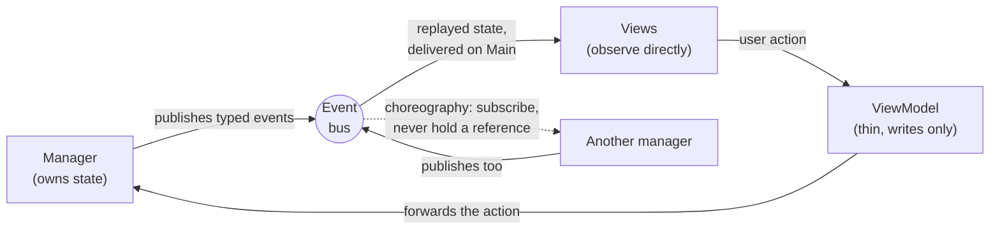
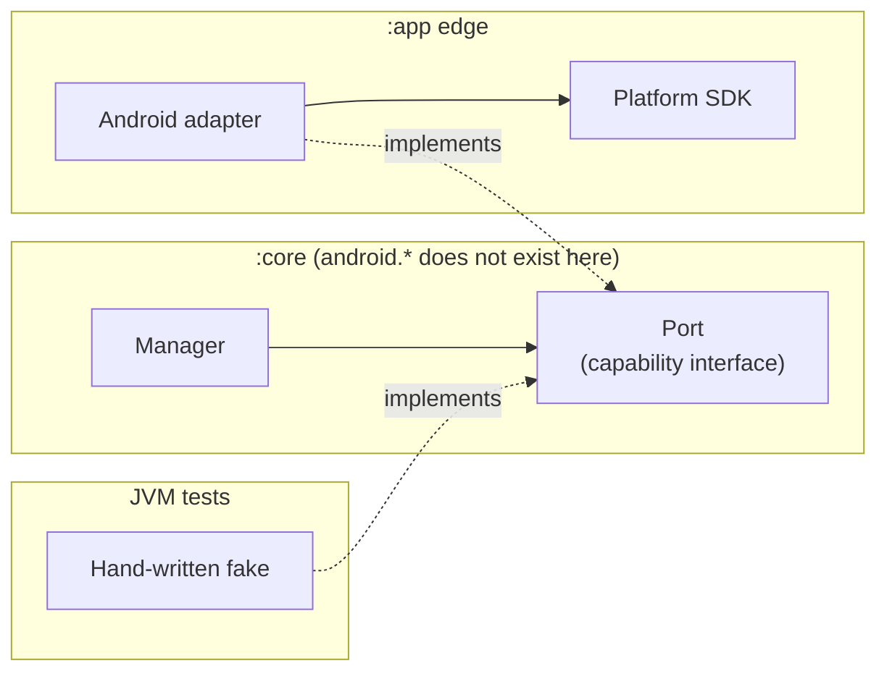
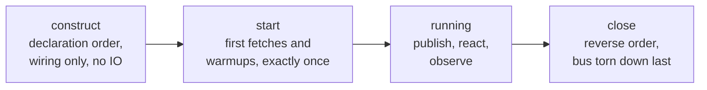
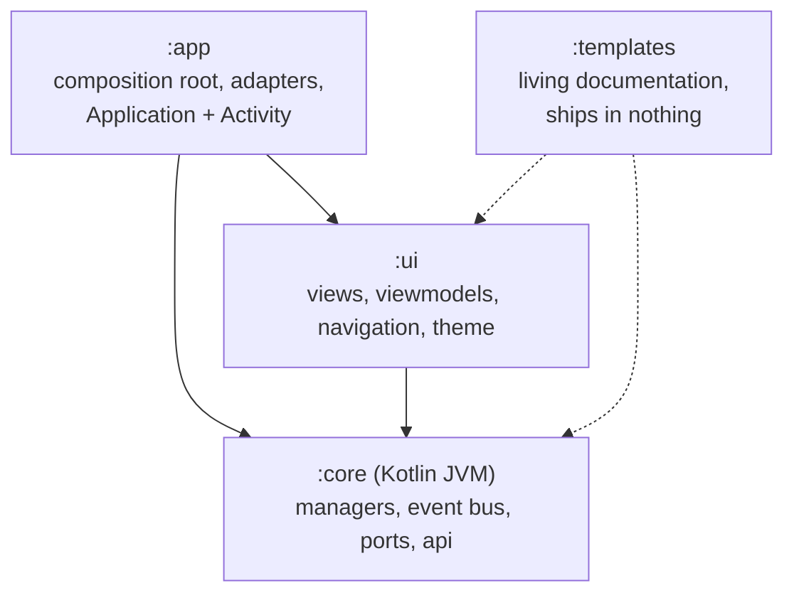

# Android-App-Template

A small, complete Android app meant to be copied and grown into a
real product. Compose UI on top of an event-driven core, wired up by
hand, and split into a few Gradle modules so the layering is enforced
by the compiler instead of by code review.

This page is the overview. The full contracts and conventions live in
[ARCHITECTURE.md](ARCHITECTURE.md).

## The idea

Managers own the app's state. When something changes, the owning
manager publishes a typed event on a shared bus. Screens observe the
bus directly, and viewmodels just forward user actions back to the
managers. That's the whole loop:



Anything that touches the platform (connectivity callbacks, Logcat,
crash backends, remote flags) sits behind a small interface, and the
Android implementation lives at the app's edge. The core never sees a
`Context`, so it stays a plain Kotlin module and its tests run on the
JVM with simple hand-written fakes:



One plain class (`AppComponent`) builds everything. Construction runs
top to bottom, first fetches happen in a separate start phase, and
teardown walks back in reverse:



## Modules

Arrows point at what a module is allowed to see. Imports in the wrong
direction don't compile:



- `:core` is plain Kotlin: the managers, the event bus, the port
  interfaces, and the API layer. `android.*` isn't on the classpath,
  so platform code can't creep in.
- `:ui` holds the views, viewmodels, navigation, and theme. It only
  sees `:core`.
- `:app` is the shell: the composition root, the Android adapters,
  the `Application`, and the single `Activity`.
- `:templates` is living documentation: fully commented example files
  that compile and test on every build but ship in nothing. Start a
  new feature by copying one; see
  [templates/README.md](templates/README.md).

Rule of thumb: if a file needs `android.*`, it belongs in `:app` or
`:ui`. If the logic still makes sense with every platform detail
removed, it belongs in `:core`.

## Why this shape

- Managers are peers. Nothing grows into a god object, and features
  land side by side instead of tangling into each other.
- State reaches the UI exactly one way, so there's one threading
  contract, one replay rule, and one place to trace any transition.
- The compiler polices the layers, not reviewers.
- Tests are real. JVM specs boot the actual component with fakes only
  at the boundaries. There's no mocking framework in the repo.
- The lifecycle is boring on purpose: build in order, start once,
  tear down in reverse. Cold start stays out of constructors.
- Every event leaves a breadcrumb, so crash reports arrive with the
  app's recent history attached.
- The whole tree is readable in an afternoon.

## Trade-offs

- "Who reacts to this event" is a grep, not a call hierarchy.
- The bus is lossy by design (latest value wins). Right for state,
  wrong for work items that must never be dropped.
- DI is wired by hand, so there are no compile-time missing-binding
  errors. Guard tests stand in for them.
- The router is hand-rolled: typed and process-death-safe, but
  fancier navigation is deferred until a real need shows up.

This also isn't Google's default architecture (per-screen ViewModel
state holders). An app that's mostly independent CRUD screens with
little shared state wouldn't earn the trade, and the standard stack
would serve it more simply.

## Stack

Kotlin 2.4.10, AGP 9.0.1 (built-in Kotlin; don't apply
`org.jetbrains.kotlin.android`), Gradle 9.1.0, compileSdk 36,
minSdk 32, Hilt + KSP, Compose BOM 2026.06.01, Ktor 3.5.1,
DataStore 1.2.1, kotlinx-serialization.

## Build and test

```
./gradlew :app:assembleDebug
./gradlew :core:test :ui:testDebugUnitTest :app:testDebugUnitTest
./gradlew :app:connectedDebugAndroidTest    # real device or emulator
```

The repo is self-contained; no external checkouts required.

## Digging deeper

- [ARCHITECTURE.md](ARCHITECTURE.md): the contracts and conventions
  (events, managers, wiring, flags, navigation, logging, tests).
- [templates/README.md](templates/README.md): copy-paste starting
  points for a new manager, port, screen, and their tests.
- [ARCHITECTURE-SCALING.md](ARCHITECTURE-SCALING.md): what to add
  when the app grows, and when it's worth adding.
